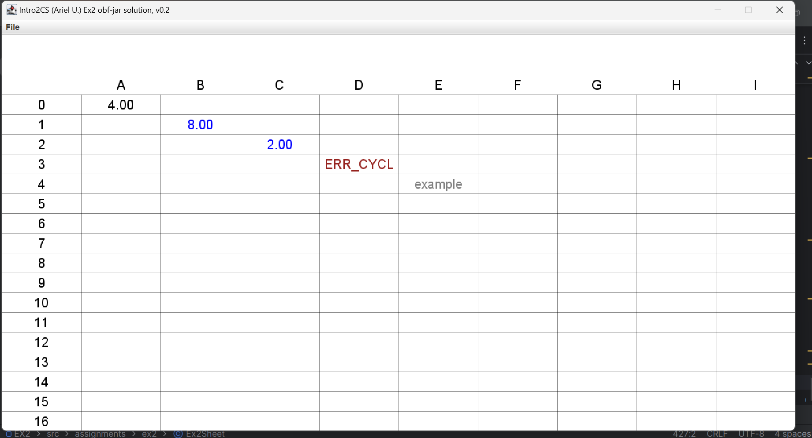

ID:325310142
**README: Spreadsheet Implementation in Java**  

This project is a **Java-based spreadsheet implementation** designed for the I2CS ArielU 2025A course. The spreadsheet supports the following key features:

- **Dynamic cell evaluation:** Calculate values dynamically based on formulas and references to other cells.
- **Arithmetic and text handling:** Input text, numbers, or formulas (e.g., `=A1 + B2`).
- **Error management:** Detects and handles circular dependencies, invalid formulas, and other errors gracefully.
- **Persistence:** Save and load the spreadsheet's state for continued work.

This system provides a robust foundation for creating and managing structured data efficiently while maintaining a simple and user-friendly interface.

